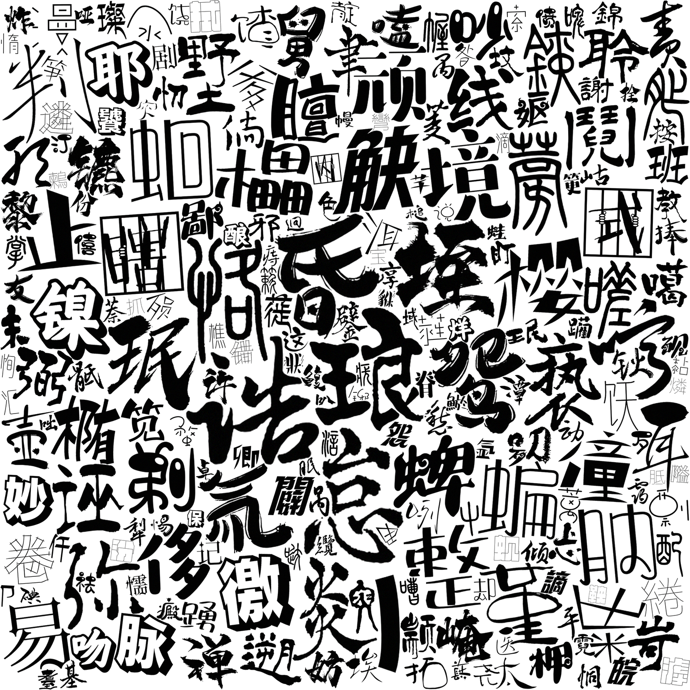
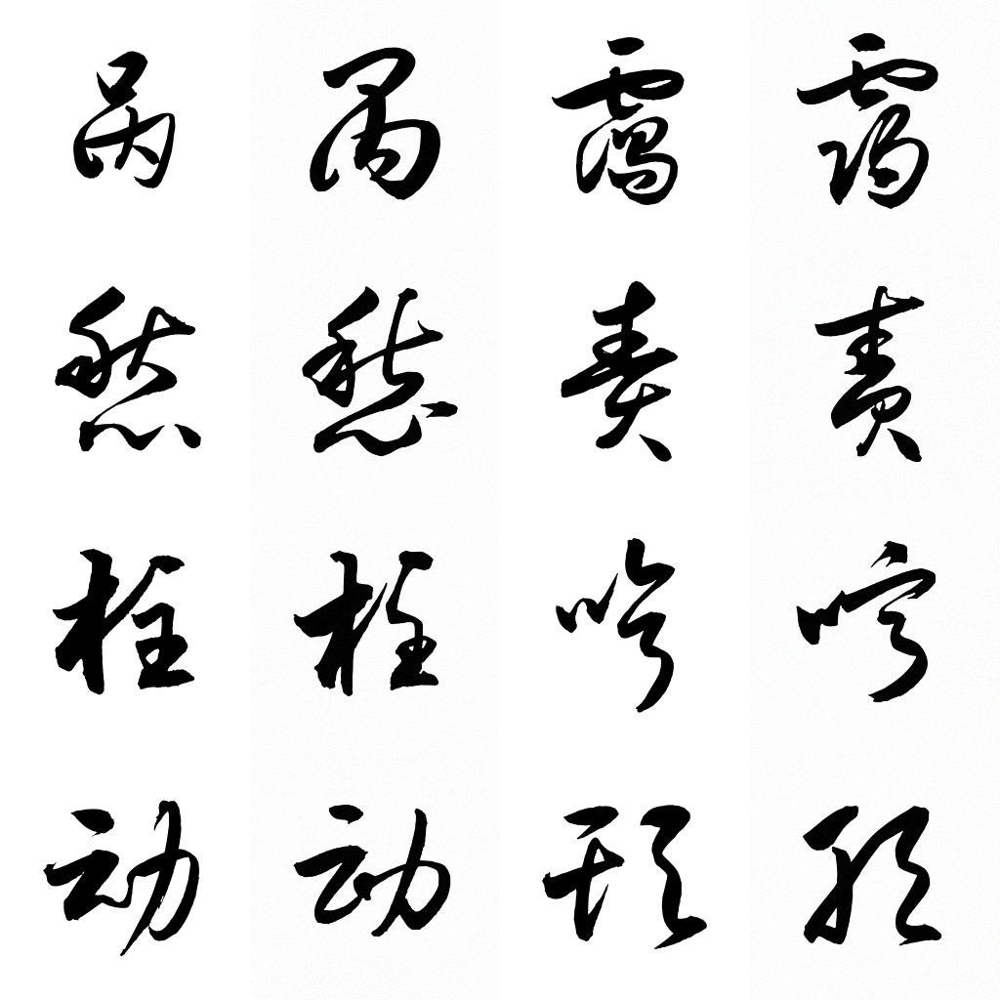
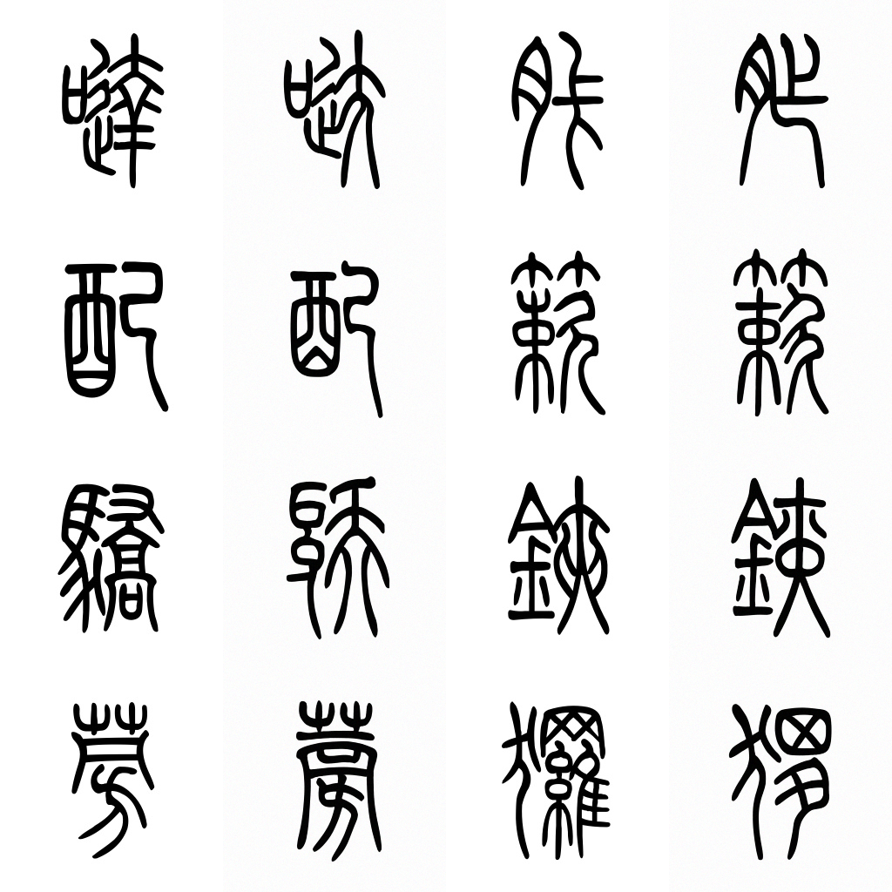
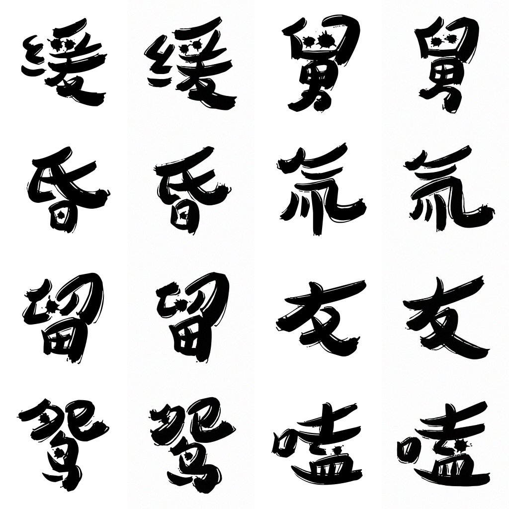

<p align="center">
  
</p>

<h2 align="center">zi2zi-JiT：基于像素空间扩散 Transformer 的字体合成</h2>

<p align="center">
  
</p>

## 概述

<p align="center">
  
</p>

zi2zi-JiT 是 [JiT](https://arxiv.org/abs/2511.13720)（Just image Transformer）的条件变体，专为中文字体风格迁移设计。给定一个源字符和一个风格参考，它可以合成目标字体风格的字符。

如上图所示，该架构在基础 JiT 模型上扩展了三个组件：

- **Content Encoder** — 一个 CNN，用于捕获输入字符的结构布局，改编自 [FontDiffuser](https://arxiv.org/abs/2312.12142)。
- **Style Encoder** — 一个 CNN，用于从目标字体的参考字形中提取风格特征。
- **多源上下文混合** — 不同于原始 JiT 中仅基于单个类别 token 进行 conditioning，字体、风格和内容 embedding 被拼接为统一的条件序列。

### 训练

提供两种模型变体 — JiT-B/16 和 JiT-L/16 — 均在包含 400+ 种字体的语料库上训练了 2,000 个 epoch（70% 简体中文、20% 繁体中文、10% 日文），共计 300k+ 张字符图像。每种字体用于训练的最大字符数上限为 800。

### 评估

生成的字形按照 [FontDiffuser](https://arxiv.org/abs/2312.12142) 中的评估协议与真实参考进行对比。所有指标均在 2,400 对样本上计算。

| 模型 | FID ↓ | SSIM ↑ | LPIPS ↓ | L1 ↓ |
|-------|-------|--------|---------|------|
| JiT-B/16 | 53.81 | 0.6753 | 0.2024 | 0.1071 |
| JiT-L/16 | 56.01 | 0.6794 | 0.1967 | 0.1043 |

## 使用方法

### 环境配置

```bash
conda env create -f environment.yaml
conda activate zi2zi-jit
pip install -e .
```

### 下载基础模型

预训练 checkpoint 可从 Google Drive 下载：

**[下载模型](https://drive.google.com/drive/folders/1QJi2ihxDBK2NF-jCE07g59YwuUTAd-iY)**

下载预训练 checkpoint 并放置在 `models/` 目录下：

```bash
mkdir -p models
# zi2zi-JiT-B-16.pth  (Base 变体)
# zi2zi-JiT-L-16.pth  (Large 变体)
```

### 数据集生成

#### 从字体文件生成

从源字体和目标字体目录生成配对数据集：

```bash
python scripts/generate_font_dataset.py \
    --source-font data/思源宋体light.otf \
    --font-dir   data/sample_single_font \
    --output-dir data/sample_dataset
```

生成的目录结构如下：

```
data/sample_dataset/
├── train/
│   ├── 001_FontA/
│   │   ├── 00000_U+XXXX.jpg
│   │   ├── 00001_U+XXXX.jpg
│   │   ├── ...
│   │   └── metadata.json
│   ├── 002_FontB/
│   │   └── ...
│   └── ...
├── test/
│   ├── 001_FontA/
│   │   └── ...
│   └── ...
└── test.npz
```

每张 `.jpg` 是一张 1024x256 的合成图：`源字符 (256) | 目标字符 (256) | 参考网格1 (256) | 参考网格2 (256)`。

#### 从渲染的字形图像生成

另外，也可以从已渲染的字符图像目录构建数据集。
每个文件应为 256x256 的 PNG 图像，以其对应的字符命名：

```
data/sample_glyphs/
├── 万.png
├── 上.png
├── 中.png
├── 人.png
├── 大.png
└── ...
```

```bash
python scripts/generate_glyph_dataset.py \
    --source-font data/思源宋体light.otf \
    --glyph-dir   data/sample_glyphs \
    --output-dir  data/sample_glyph_dataset \
    --train-count 200
```

### LoRA 微调

使用 LoRA 在单 GPU 上微调预训练模型。单个字体的微调在单张 H100 上通常不到一小时即可完成。以下示例使用 JiT-B/16，batch size 为 16，约需 4 GB 显存：

```bash
python lora_single_gpu_finetune_jit.py \
    --data_path       data/sample_dataset/train/ \
    --test_npz_path   data/sample_dataset/test.npz \
    --output_dir      run/lora_ft_sample_single/ \
    --base_checkpoint models/zi2zi-JiT-B-16.pth \
    --model           JiT-B/16 \
    --num_fonts       1000 \
    --num_chars       20000 \
    --max_chars_per_font 200 \
    --img_size        256 \
    --lora_r          32 \
    --lora_alpha      32 \
    --lora_targets    "qkv,proj,w12,w3" \
    --epochs          200 \
    --batch_size      16 \
    --blr             8e-4 \
    --warmup_epochs   1 \
    --save_last_freq  10 \
    --proj_dropout    0.1 \
    --P_mean          -0.8 \
    --P_std           0.8 \
    --noise_scale     1.0 \
    --cfg             2.6 \
    --online_eval \
    --eval_step_folders \
    --eval_freq       10 \
    --gen_bsz         16 \
    --num_images      400 \
    --seed            42
```

**关键参数：**

| 参数 | 说明 |
|---|---|
| `--num_fonts`、`--num_chars` | 与预训练模型的 embedding 维度绑定。除非从头预训练，否则请勿更改。 |
| `--max_chars_per_font` | 限制每种字体使用的字符数上限。 |
| `--lora_r`、`--lora_alpha` | LoRA 容量。更高的值提供更大的容量，但会增加显存消耗。 |
| `--batch_size` | 设为 16 约使用 ~4 GB 显存。 |
| `--cfg` | 条件引导强度。JiT-B/16 建议使用 **2.6**，JiT-L/16 建议使用 **2.4**。 |

### 生成

从微调后的 checkpoint 生成字符：

```bash
python generate_chars.py \
    --checkpoint run/lora_ft_sample_single/checkpoint-last.pth \
    --test_npz   data/sample_dataset/test.npz \
    --output_dir run/generated_chars/
```

**`generate_chars.py` 说明：**

- 当前支持的采样器为 `euler`、`heun` 和 `ab2`。
- 如果不指定 `--num_sampling_steps`，脚本会按采样器使用默认步数：
  `euler -> 20`、`heun -> 50`、`ab2 -> 20`。
- 如果既不覆盖 `--sampling_method`，也不覆盖 `--num_sampling_steps`，脚本会沿用 checkpoint 中保存的推理配置。
- 当前推荐的快速生成设置为：`--sampling_method ab2 --cfg 2.6`，并使用默认的 `20` 步。
- `heun-50` 目前更适合作为保守的历史/参考基线。在当前的 50 样本 MPS 基准中，`ab2-20` 和 `euler-20` 在 SSIM、LPIPS 和 L1 上都优于 `heun-50`，同时速度也更快。

快速生成示例：

```bash
python generate_chars.py \
    --checkpoint run/lora_ft_sample_single/checkpoint-last.pth \
    --test_npz   data/sample_dataset/test.npz \
    --output_dir run/generated_chars_ab2/ \
    --sampling_method ab2
```

### 指标计算

在生成的对比网格上计算成对指标（SSIM、LPIPS、L1、FID）：

```bash
python scripts/compute_pairwise_metrics.py \
    --device cuda \
    run/lora_ft_sample_single/heun-steps50-cfg2.6-interval0.0-1.0-image400-res256/step_10/compare/
```

## 作品

使用 zi2zi-JiT 制作的字体：

- [权衡度量体 (Zi-QuanHengDuLiang)](https://github.com/kaonashi-tyc/Zi-QuanHengDuLiang)
- [玄宗体 (Zi-XuanZongTi)](https://github.com/kaonashi-tyc/Zi-XuanZongTi)
- [Eva明朝简体 (Eva-Ming-Simplified)](https://github.com/kaonashi-tyc/Eva-Ming-Simplified)

## 效果展示

左侧为真实字体，右侧为生成结果

| | |
|:---:|:---:|
|  |  |
|  |  |
|  |  |

### 许可证

代码采用 MIT 许可证。生成的字体输出还需遵守 [LICENSE](LICENSE) 中的"字体产物许可附录"：

- 允许商业使用
- 当分发的字体产品中使用了超过 200 个由本仓库工具生成的字符时，需注明出处

### 参考文献

- [JiT: Back to Basics: Let Denoising Generative Models Denoise](https://arxiv.org/abs/2511.13720)
- [FontDiffuser: One-Shot Font Generation via Denoising Diffusion with Multi-Scale Content Aggregation and Style Contrastive Learning](https://arxiv.org/abs/2312.12142) ([代码](https://github.com/yeungchenwa/FontDiffuser))

本项目基于以下项目的代码和思路构建：

- [FontDiffuser](https://github.com/yeungchenwa/FontDiffuser) — content/style encoder 设计与评估协议
- [JiT](https://github.com/LTH14/JiT) — 基础 diffusion transformer 架构

### 引用

```bibtex
@article{zi2zi-jit,
  title   = {zi2zi-JiT: Font Synthesis with Pixel Space Diffusion Transformers},
  author  = {Yuchen Tian},
  year    = {2026},
  url     = {https://github.com/kaonashi-tyc/zi2zi-jit}
}
```
